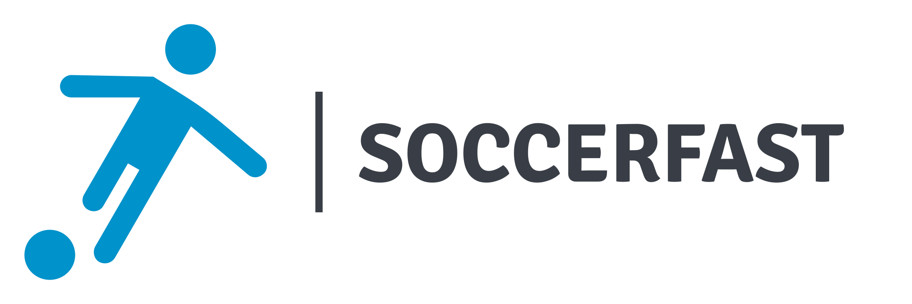

<!--
*** Thanks for checking out the Best-README-Template. If you have a suggestion
*** that would make this better, please fork the repo and create a pull request
*** or simply open an issue with the tag "enhancement".
*** Don't forget to give the project a star!
*** Thanks again! Now go create something AMAZING! :D
-->

<!-- PROJECT SHIELDS -->
<!--
*** I'm using markdown "reference style" links for readability.
*** Reference links are enclosed in brackets [ ] instead of parentheses ( ).
*** See the bottom of this document for the declaration of the reference variables
*** for contributors-url, forks-url, etc. This is an optional, concise syntax you may use.
*** https://www.markdownguide.org/basic-syntax/#reference-style-links
-->
[![Contributors][contributors-shield]][contributors-url]
[![Forks][forks-shield]][forks-url]
[![Stargazers][stars-shield]][stars-url]
[![Issues][issues-shield]][issues-url]
[![MIT License][license-shield]][license-url]
[![LinkedIn][linkedin-shield]][linkedin-url]

<!-- PROJECT LOGO -->
 

  

<h3 align="center">SoccerFast</h3>

  

    Project for SoccerFast, the best soccer tournament organizer in Miami, Florida.
     
    <a href="https://github.com/saguirre/soccerfast"><strong>Explore the docs »</strong></a>
     
     
    <a href="https://github.com/saguirre/soccerfast">View Demo</a>
    ·
    <a href="https://github.com/saguirre/soccerfast/issues">Report Bug</a>
    ·
    <a href="https://github.com/saguirre/soccerfast/issues">Request Feature</a>
  

<!-- TABLE OF CONTENTS -->

  
Table of Contents

  <ol>
    <li>
      <a href="#about-the-project">About The Project</a>
      <ul>
        <li><a href="#built-with">Built With</a></li>
      </ul>
    </li>
    <li><a href="#contributing">Contributing</a></li>
    <li><a href="#license">License</a></li>
    <li><a href="#contact">Contact</a></li>
  </ol>

<!-- ABOUT THE PROJECT -->
## About The Project

[![SoccerFast][product-screenshot]](https://soccerfast.ondigitalocean.app)

Here's a blank template to get started: To avoid retyping too much info. Do a search and replace with your text editor for the following: `github_username`, `repo_name`, `twitter_handle`, `linkedin_username`, `email_client`, `email`, `project_title`, `project_description`

(<a href="#top">back to top</a>)

### Built With

* [![Next][Next.js]][Next-url]
* [![React][React.js]][React-url]
* [![Nest][Nest.js]][Nest-url]
* [![Nest][Nest.js]][Nest-url]

(<a href="#top">back to top</a>)

<!-- CONTRIBUTING -->
## Contributing

Contributions are what make the open source community such an amazing place to learn, inspire, and create. Any contributions you make are **greatly appreciated**.

If you have a suggestion that would make this better, please fork the repo and create a pull request. You can also simply open an issue with the tag "enhancement".
Don't forget to give the project a star! Thanks again!

1. Fork the Project
2. Create your Feature Branch (`git checkout -b feature/AmazingFeature`)
3. Commit your Changes (`git commit -m 'Add some AmazingFeature'`)
4. Push to the Branch (`git push origin feature/AmazingFeature`)
5. Open a Pull Request

(<a href="#top">back to top</a>)

<!-- LICENSE -->
## License

Distributed under the MIT License. See `LICENSE.txt` for more information.

(<a href="#top">back to top</a>)

<!-- CONTACT -->
## Contact

Santiago Aguirre - [@twitter_handle](https://twitter.com/twitter_handle) - saguirrews@gmail.com

Project Link: [https://github.com/saguirre/soccerfast](https://github.com/saguirre/soccerfast)

(<a href="#top">back to top</a>)

<!-- MARKDOWN LINKS & IMAGES -->
<!-- https://www.markdownguide.org/basic-syntax/#reference-style-links -->
[contributors-shield]: https://img.shields.io/github/contributors/saguirre/soccerfast.svg?style=for-the-badge
[contributors-url]: https://github.com/saguirre/repo_name/graphs/contributors
[forks-shield]: https://img.shields.io/github/forks/saguirre/soccerfast.svg?style=for-the-badge
[forks-url]: https://github.com/saguirre/soccerfast/network/members
[stars-shield]: https://img.shields.io/github/stars/saguirre/soccerfast.svg?style=for-the-badge
[stars-url]: https://github.com/saguirre/soccerfast/stargazers
[issues-shield]: https://img.shields.io/github/issues/saguirre/soccerfast.svg?style=for-the-badge
[issues-url]: https://github.com/saguirre/soccerfast/issues
[license-shield]: https://img.shields.io/github/license/saguirre/soccerfast.svg?style=for-the-badge
[license-url]: https://github.com/saguirre/soccerfast/blob/master/LICENSE.txt
[linkedin-shield]: https://img.shields.io/badge/-LinkedIn-black.svg?style=for-the-badge&logo=linkedin&colorB=555
[linkedin-url]: https://linkedin.com/in/santiago-aguirre-717248161
[product-screenshot]: https://soccerfast.nyc3.digitaloceanspaces.com/user-avatars/ce063efd-1fe2-4240-9ba6-1772446e8111.png
[Next.js]: https://img.shields.io/badge/next.js-000000?style=for-the-badge&logo=nextdotjs&logoColor=white
[Next-url]: https://nextjs.org/
[React.js]: https://img.shields.io/badge/React-20232A?style=for-the-badge&logo=react&logoColor=61DAFB
[React-url]: https://reactjs.org/
[Nest.js]: https://img.shields.io/badge/Nest-20232A?style=for-the-badge&logo=nest&logoColor=61DAFB
[Nest-url]: https://nestjs.com/
